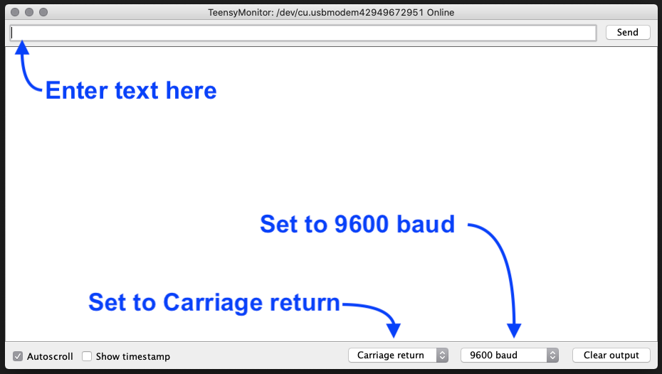

## NOTE: This Document Is In Process

# Update BC127 Melody Firmware Tympan Rev D
The BC127 Bluetooth radio that comes with the Tympan Rev D works out of the box just fine for most purposes. However, the Melody Audio firmware is most likely out of date. If you choose to update the Melody firmware, let this be your guide.

As of this writing, Sierra Wireless has published version 7.x of the Melody Audio firmware. This guide will show you how to determine the firmware version of your Tympan BC127, and take you through the steps to upgrade. 

### This tutorial assumes you already know how to connect to your Tympan and upload new code to it via the Arduino IDE. If you need to get up to speed, please go to our [Getting Started Wiki](https://github.com/Tympan/Docs/wiki/Getting-Starting-with-Tympan)

# Prepare Your Tympan

1. Connect your Tympan to your computer and launch the Arduino IDE
2. Select the Serial Port that your Tympan is connected to, open the Serial Monitor in Arduino, and set the baud rate to 9600
3. Open the example sketch UpgradeFirmware_TympanBT by navigating to 

		File > Examples > Tympan Library > Utility
	
4. Upload the sketch to your Tympan
5. When the upload is complete, the Tympan will happily blink the two LEDs back an forth
6. if you did not open the Serial Monitor in the Arduion IDE, do it now. This, along with the sketch you just uploaded, will give you the ability to talk directly with the BC127 radio module. When your Tympan starts up, this software will put the BC127 module into Command Mode and print the following messages to the Serial Window

		*** TypmanBT Serial 9600 Pasthrough Starting...
		*** Switching Tympan RevD BT module into command mode...
		ERROR
		*** Could be ERROR response. That's OK here
		*** Now in BT <-> USB Echo mode ***

The lines that start with `***` are from the Tympan, and the lines that don't have the `***` are from the BC127. 

### Follow the next steps to test your version and upgrade if necessary.

# Check Melody Firmware Version
Once connected, anything that you type in the terminal window and send to the Tympan will be passed on the the BC127, and anything that the BC127 sends back will appear in the terminal window. In order to make this happen, we have to make sure that the settings are correct in the Serial Monitor. The BC127 want's to see a Carriage return at the end of any commands, so make sure that is set. Then, when you press ENTER it will add the Carriage return to the message.

## Request Melody Version 

In the Serial Monitor, type in the word `VERSION` and hit ENTER. The  BC127 will reply with a bunch of stuff like this:

		BlueCreation Copyright 2013
		Melody Audio V5.0 RC11
		Build: 20131106_115156
			Bluetooth address 20FABB08F6BF
			Profiles: SPP HFP A2DP AVRCP PBAP MAP BLE
			A2DP Codecs: SBC
		Ready

In this case, my Melody firmware is woefully out of date! Time to upgrade! 

If you are interested in learning more about communicating in Command Mode, check out the [Melody Audio User Guide](https://source.sierrawireless.com/resources/airprime/hardware_specs_user_guides/bc127-melody-audio-7-user-guide/#sthash.9gawTWTs.dpbs) for more.

# Upgrade Firmware
 
 We need to download the Device Firmware Update (DFU) tool, which only works on **Windows PC**, and the latest firmware release. Go to the [BC127 Firmware Upgrade Tool](https://source.sierrawireless.com/resources/airprime/software/bc127-firmware-upgrade-tool/#sthash.djw3AqOU.dpbs) web page where you will also find a link to a PDF Application Note guide. Then go to the [BC127 Firmware Release](https://source.sierrawireless.com/resources/airprime/software/bc127-firmware/#sthash.glaxf9GJ.v9U9vuYZ.dpbs) page and download the Firmware Release `Melody_7_x`. The releases of the same version with extensions to the name add and subtract different features. If you're interested, dig into the Melody Audio User Guide linked to above for details on the releases.
 
**Note:** Sierra Wireless requires that you have an account with them in order to download *anything* from their website! 
 
Additionally, there is some instruction on how to make your BC127 ready to receive the upgrade. As of this writing, you have to connect via Serial Monitor (as we have done) and then type in `DFU` followed by a Carriage return. Then, disconnect the Serial port, and run the Firmware Upgrade Tool. 

